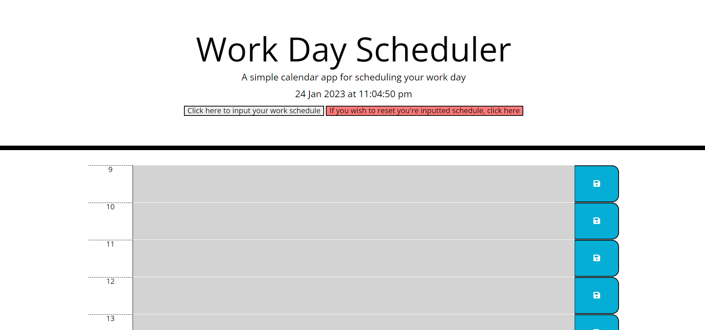

## Description 
This project is a dynamic work day planner enabling users to input their custom work hours and generate a planner for their work day. The planner consists of time blocks representing each hour of this work day, with text areas for the user to input notes for each hour. The application utilises JavaScript and jQuery to generate the time blocks dynamically based on the user's input. The project uses local storage to save and persist user input. Moment.js is being used additionally to provide an up to date time at the top of the web page. 

### How to use this program 

* Firstly, access the Workday Planner web page at the following url: https://harrygarstang.github.io/Workday-Planner/

* Secondly, click the 'Click here to input your workday schedule' button 

* You will be prompted to enter firstly your time for the start of your working day, followed by another prompt requesting the time of the end of your working day. 

* Please provide these in 24 hour format. For example, if you're workday was 09:00 until 18:00 - this would be a start time of 9, and an end time of 18. 

### What I have learnt 

* I have learnt how to use JavaScript to create a dynamic user interface using jQuery. 
* I have learnt how to use JavaScript to interact with the browser's local storage to store and retrieve user input. 
* I used moment.js to retrieve the current time. 
* I challenged my understanding of DOM manipulation to dynamically create and modify elements on a page. 

## Credits 

* https://developer.mozilla.org/en-US/docs/Glossary/IIFE

